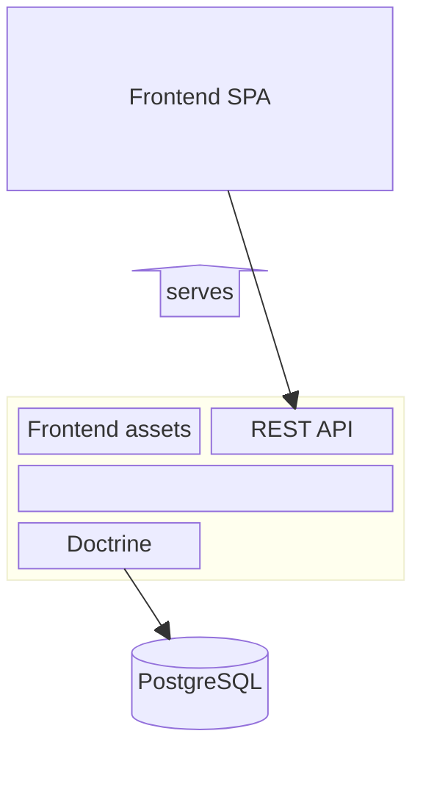

# Quizmaster Architecture

Quizmaster follows a traditional client-server architecture.

## Frontend
Frontend is a Single-Page Application (SPA) in [React 19](https://react.dev/). It uses [react-router](https://reactrouter.com/) for routing.

## Backend
Backend is a PHP application, serving both frontend as a SPA (Single-Page Application) at URL `/`, and REST APIs for the frontend at URLs starting with `/api/`.

Data are stored in PostgreSQL dabatase.
- DB is accessed using Doctrine,
- data scheme versioned and migrated using Doctrine.

## Component Diagram

